# O-RADS Decision Tree - Graphical Flowchart

This document provides a visual representation of the O-RADS decision tree using Mermaid flowchart syntax.

## Full Decision Tree

```mermaid
flowchart TD
    START([Start Assessment]) --> ROOT{Lesion Type?}
    
    %% Path 1: Normal/Physiologic
    ROOT -->|Normal ovary / Physiologic cyst| O1[O-RADS 1<br/>Normal Ovary<br/>No follow-up]
    
    %% Path 2: Incomplete
    ROOT -->|Incomplete study| O0[O-RADS 0<br/>Incomplete Evaluation<br/>Repeat US or MRI]
    
    %% Path 3: Simple Cyst
    ROOT -->|Simple cyst| SIMPLE{Size?}
    SIMPLE -->|≤3 cm| SIMPLE_SIZE1{Menopausal Status?}
    SIMPLE_SIZE1 -->|Premenopausal| O1
    SIMPLE_SIZE1 -->|Postmenopausal| O2A[O-RADS 2<br/>Almost Certainly Benign<br/>No follow-up]
    SIMPLE -->|>3 cm to 5 cm| SIMPLE_SIZE2{Menopausal Status?}
    SIMPLE_SIZE2 -->|Premenopausal| O2B[O-RADS 2<br/>Almost Certainly Benign<br/>No follow-up]
    SIMPLE_SIZE2 -->|Postmenopausal| O2C[O-RADS 2<br/>Almost Certainly Benign<br/>Follow-up US 12 months]
    SIMPLE -->|>5 cm but <10 cm| O2D[O-RADS 2<br/>Almost Certainly Benign<br/>Follow-up US 12 months]
    SIMPLE -->|≥10 cm| O3A[O-RADS 3<br/>Low Risk<br/>Consider follow-up US 6 months]
    
    %% Path 4: Classic Benign Lesions
    ROOT -->|Classic benign lesion| CLASSIC{Lesion Type?}
    
    CLASSIC -->|Hemorrhagic cyst| HEMO{Menopausal Status?}
    HEMO -->|Premenopausal| HEMO_SIZE{Size?}
    HEMO_SIZE -->|≤5 cm| O2E[O-RADS 2<br/>Typical Hemorrhagic Cyst<br/>No follow-up]
    HEMO_SIZE -->|>5 cm but <10 cm| O2F[O-RADS 2<br/>Typical Hemorrhagic Cyst<br/>Follow-up US 2-3 months]
    HEMO_SIZE -->|≥10 cm| O3B[O-RADS 3<br/>Typical Hemorrhagic Cyst Large<br/>Follow-up US 6 months]
    HEMO -->|Early postmenopausal| O2G[O-RADS 2<br/>Typical Hemorrhagic Cyst<br/>Follow-up US 2-3 months or MRI]
    HEMO -->|Late postmenopausal| O3C[O-RADS 3<br/>Atypical - Recategorize<br/>Reassess with other descriptors]
    
    CLASSIC -->|Dermoid cyst| DERMOID{Size?}
    DERMOID -->|≤3 cm| O2H[O-RADS 2<br/>Typical Dermoid Cyst<br/>May consider follow-up US 12 months]
    DERMOID -->|>3 cm but <10 cm| O2I[O-RADS 2<br/>Typical Dermoid Cyst<br/>Follow-up US 12 months]
    DERMOID -->|≥10 cm| O3D[O-RADS 3<br/>Typical Dermoid Cyst<br/>Consider follow-up US 6 months]
    
    CLASSIC -->|Endometrioma| ENDO{Size?}
    ENDO -->|<10 cm| ENDO_MENO{Menopausal Status?}
    ENDO_MENO -->|Premenopausal| O2J[O-RADS 2<br/>Typical Endometrioma<br/>Follow-up US 12 months]
    ENDO_MENO -->|Postmenopausal| O2K[O-RADS 2<br/>Typical Endometrioma<br/>Follow-up US 2-3 months then 12 months]
    ENDO -->|≥10 cm| O3E[O-RADS 3<br/>Typical Endometrioma<br/>Consider follow-up US 6 months]
    
    CLASSIC -->|Paraovarian cyst| O2L[O-RADS 2<br/>Typical Paraovarian Cyst<br/>No follow-up]
    CLASSIC -->|Peritoneal inclusion cyst| O2M[O-RADS 2<br/>Typical Peritoneal Inclusion Cyst<br/>No follow-up]
    CLASSIC -->|Hydrosalpinx| O2N[O-RADS 2<br/>Typical Hydrosalpinx<br/>No follow-up]
    
    %% Path 5: Cystic Lesion Non-Classic
    ROOT -->|Cystic lesion non-classic| CYSTIC{Solid Component?}
    
    CYSTIC -->|Yes - solid component present| SOLID_LOC{Locularity?}
    SOLID_LOC -->|Unilocular| SOLID_PAP{Papillary Projections?}
    SOLID_PAP -->|<4 papillary projections| O4A[O-RADS 4<br/>Intermediate Risk<br/>US specialist, MRI, or gyn-onc]
    SOLID_PAP -->|≥4 papillary projections| O5A[O-RADS 5<br/>High Risk<br/>Refer to gyn-oncologist]
    SOLID_LOC -->|Bilocular or Multilocular| SOLID_CS{Color Score?}
    SOLID_CS -->|CS 1-2 no/minimal flow| O4B[O-RADS 4<br/>Intermediate Risk<br/>US specialist, MRI, or gyn-onc]
    SOLID_CS -->|CS 3-4 moderate/strong flow| O5B[O-RADS 5<br/>High Risk<br/>Refer to gyn-oncologist]
    
    CYSTIC -->|No - no solid component| NO_SOLID_LOC{Locularity?}
    
    NO_SOLID_LOC -->|Unilocular| UNI_WALL{Wall?}
    UNI_WALL -->|Smooth| UNI_SIZE{Size?}
    UNI_SIZE -->|<10 cm| O2O[O-RADS 2<br/>Almost Certainly Benign<br/>Follow-up US 6-12 months]
    UNI_SIZE -->|≥10 cm| O3F[O-RADS 3<br/>Low Risk - Large Unilocular<br/>Consider follow-up US 6 months]
    UNI_WALL -->|Irregular| O3G[O-RADS 3<br/>Low Risk - Irregular Unilocular<br/>Consider follow-up US 6 months]
    
    NO_SOLID_LOC -->|Bilocular| BI_WALL{Wall?}
    BI_WALL -->|Smooth| BI_SIZE{Size?}
    BI_SIZE -->|<10 cm| O2P[O-RADS 2<br/>Almost Certainly Benign<br/>Follow-up US 6 months]
    BI_SIZE -->|≥10 cm| O3H[O-RADS 3<br/>Low Risk - Large Bilocular<br/>Consider follow-up US 6 months]
    BI_WALL -->|Irregular| O4C[O-RADS 4<br/>Intermediate Risk - Irregular Bilocular<br/>US specialist, MRI, or gyn-onc]
    
    NO_SOLID_LOC -->|Multilocular| MULTI_WALL{Wall?}
    MULTI_WALL -->|Smooth| MULTI_CS{Size & Color Score?}
    MULTI_CS -->|<10 cm and CS <4| O3I[O-RADS 3<br/>Low Risk - Multilocular<br/>Consider follow-up US 6 months]
    MULTI_CS -->|≥10 cm and CS <4| O4D[O-RADS 4<br/>Intermediate Risk - Large Multilocular<br/>US specialist, MRI, or gyn-onc]
    MULTI_CS -->|Any size with CS 4| O4E[O-RADS 4<br/>Intermediate Risk - Highly Vascular<br/>US specialist, MRI, or gyn-onc]
    MULTI_WALL -->|Irregular| O4F[O-RADS 4<br/>Intermediate Risk - Irregular Multilocular<br/>US specialist, MRI, or gyn-onc]
    
    %% Path 6: Solid Mass
    ROOT -->|Solid mass| SOLID_CONTOUR{Contour?}
    SOLID_CONTOUR -->|Irregular| O5C[O-RADS 5<br/>High Risk - Irregular Solid<br/>Refer to gyn-oncologist]
    SOLID_CONTOUR -->|Smooth| SOLID_SHADOW{Shadowing?}
    SOLID_SHADOW -->|Yes - broad/diffuse shadowing| SOLID_SHADOW_CS{Color Score?}
    SOLID_SHADOW_CS -->|CS 1 no flow| O3J[O-RADS 3<br/>Low Risk - Avascular Solid<br/>Consider follow-up US 6 months]
    SOLID_SHADOW_CS -->|CS 2-3 minimal/moderate flow| O3K[O-RADS 3<br/>Low Risk - Shadowing Solid<br/>Consider follow-up US 6 months]
    SOLID_SHADOW_CS -->|CS 4 very strong flow| O5D[O-RADS 5<br/>High Risk - Highly Vascular Solid<br/>Refer to gyn-oncologist]
    SOLID_SHADOW -->|No shadowing| SOLID_NO_SHADOW_CS{Color Score?}
    SOLID_NO_SHADOW_CS -->|CS 1 no flow| O3L[O-RADS 3<br/>Low Risk - Avascular Solid<br/>Consider follow-up US 6 months]
    SOLID_NO_SHADOW_CS -->|CS 2-3 minimal/moderate flow| O4G[O-RADS 4<br/>Intermediate Risk - Vascular Solid<br/>US specialist, MRI, or gyn-onc]
    SOLID_NO_SHADOW_CS -->|CS 4 very strong flow| O5E[O-RADS 5<br/>High Risk - Highly Vascular Solid<br/>Refer to gyn-oncologist]
    
    %% Path 7: Ascites/Peritoneal Nodules
    ROOT -->|Ascites / Peritoneal nodules| O5F[O-RADS 5<br/>High Risk - Ascites/Peritoneal Nodules<br/>Refer to gyn-oncologist]
    
    %% Styling
    classDef orads0 fill:#808080,stroke:#000,color:#fff
    classDef orads1 fill:#90EE90,stroke:#000,color:#000
    classDef orads2 fill:#98FB98,stroke:#000,color:#000
    classDef orads3 fill:#FFD700,stroke:#000,color:#000
    classDef orads4 fill:#FFA500,stroke:#000,color:#000
    classDef orads5 fill:#FF0000,stroke:#000,color:#fff
    
    class O0 orads0
    class O1 orads1
    class O2A,O2B,O2C,O2D,O2E,O2F,O2G,O2H,O2I,O2J,O2K,O2L,O2M,O2N,O2O,O2P orads2
    class O3A,O3B,O3C,O3D,O3E,O3F,O3G,O3H,O3I,O3J,O3K,O3L orads3
    class O4A,O4B,O4C,O4D,O4E,O4F,O4G orads4
    class O5A,O5B,O5C,O5D,O5E,O5F orads5
```

## Notes

- **Color Coding**: The flowchart uses color coding to represent O-RADS scores:
  - ⬜ Gray: O-RADS 0 (Incomplete)
  - 🟢 Green: O-RADS 1-2 (Normal/Benign)
  - 🟡 Yellow: O-RADS 3 (Low Risk)
  - 🟠 Orange: O-RADS 4 (Intermediate Risk)
  - 🔴 Red: O-RADS 5 (High Risk)

- **Total Paths**: 41 unique paths through the decision tree
- **Average Depth**: ~3.5 clicks per path
- **Most Common Score**: O-RADS 2 (39% of paths)

## Viewing Instructions

This file uses Mermaid syntax. To view the diagrams:

1. **GitHub/GitLab**: Diagrams render automatically in markdown files
2. **VS Code**: Install the "Markdown Preview Mermaid Support" extension
3. **Online**: Copy the mermaid code blocks to [mermaid.live](https://mermaid.live)
4. **Documentation Tools**: Most modern documentation platforms support Mermaid

---

*Generated from O-RADS US v2022 (ACR, November 2022)*

